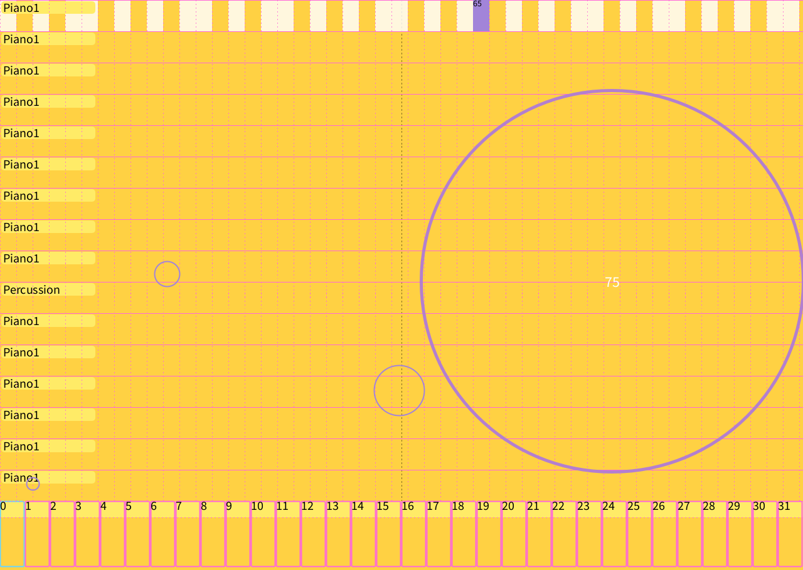

# SoftSynth

A software synthesizer framework for synesthetic instrument exploration and visualization.

- Provides MIDI note play back and 32 step sequencing using the Java Sound API and Gervil 16 channel software synthesizer.
- Synestrument base class provides note, mouse, and keyboard handling to allow quick prototypes of new Synestruments

# Included Instruments
- Keyano - 16 channel keyboard, per channel path setting, click to play note or drag for fun effects
- Beztar - 16 channel strummable piano, plays natural notes only, per channel patch
- FeckCOF - Circle of Fifths experiement, play chords or single notes on the COF wheel, per channel patch
- Bawler - Generative bouncy ball drones, notes, and beats based on Keyano

# User Guide
- After dowloading or cloning open the [SoftSynth sketch](SoftSynth.pde) then click "Play"
- Interface is shown with the **Keyano** activated.  Click around and make some sounds, right click to change the patch, click and drag perhaps!
- Pressing **'q'** will move through the installed synestruments listed above.  Click (hold the button down maybe?) around and find out, click and drag slow/fast - have fun.
- Pressing **'r'** turns on sequence recording
- Pressing **'p'** plays the sequence (and records if record is on)
