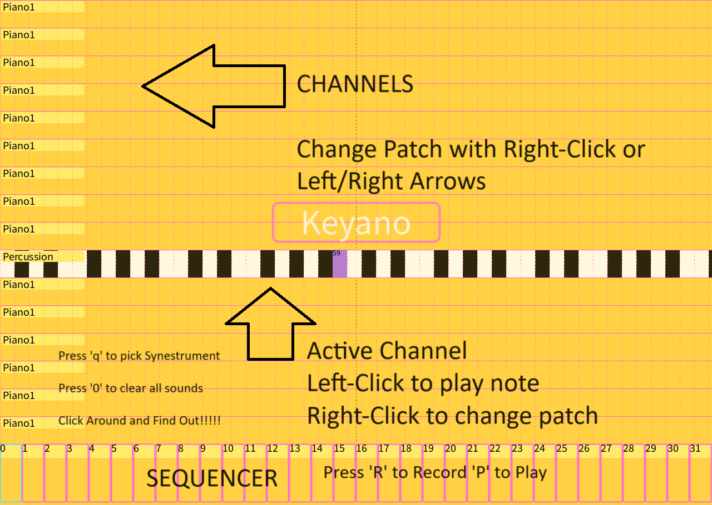

# SynestR

A software synthesizer framework for **SYNES**thetic ins**TR**ument exploration and visualization in [Processing](http://processing.org)

- Provides MIDI note playback and 32 step sequencing using the Java Sound API and Gervill 16 channel software synthesizer
- Synestrument base class provides note, mouse, and keyboard handling to allow quick prototypes of new Synestruments
- Provides serial port reading for hooking up your Arduino or Pico ideas - see my [BounceHouse](https://github.com/dandegeest/BounceHouse) MicroPython project as an example



# Included Synestruments
- Keyano - 16 channel keyboard, per channel patch, click to play note or drag for fun effects
- Beztar - 16 channel strummable synestrument, plays natural notes, per channel patch
- FeckCOF - Circle of Fifths synestrument, play chords or single notes on the COF wheel, per channel patch
- Bawler - Generative bouncy bawl drones, notes, and beats based on Keyano

# User Guide
- After dowloading or cloning open the [SoftSynth sketch](SoftSynth.pde) then click "Play"
- Interface is shown with the **Keyano** activated.  Click around and make some sounds, right click to change the patch, click and drag perhaps!
- Pressing **'q'** will move through the installed synestruments listed above.  Click (hold the button down maybe?) around and find out, click and drag slow/fast - have fun.
- Pressing **'r'** turns on sequence recording press again to turn off
- Pressing **'p'** plays the sequence (and records if record is on) press again to turn off
- Pressing **'c'** clears the sequence
- Pressing **'0'** stops and removes all notes from the playback

# Project Brief
> Synesthetic Instrument
>
> Create an 'audiovisual instrument' that allows a user or performer to produce tightly responsive and coupled sound and visuals (video, Processing window, etc.). Your software should make possible the creation of both dynamic imagery and noise/sound/music, simultaneously, in real-time.
>
>The challenge is to **create an open-ended system where the audio and visual modalities are equally expressive**. Its **results should be inexhaustible, deeply variable, and dependent on the performer's /user's choices**. The basic principles of the instrument's operation should be easy to learn, while at the same time should encourage or provoke sophisticated expression. 
>
> Use the tools learned this semester to create an instrument that receives input from the performer or user. Imagine how this will be input into the system or application: will the performer use the keyboard, the mouse, a multi-touch trackpad, a webcam, push buttons, or some other sensor? Select and construct your instrument's physical interface with care and consider the expressive affordances. Categorize the data that is input and output: are they continuous values, changes in electrical circuitry, MIDI, OSC, or changes to logical states.
>
> Assume your instrument generates output for a graphic display and audio system. Think of different visual possibilities such as variables like hue, saturation, shape, texture, pixel data, PVector motion. And think about different auditory elements such as pitch, filters, samples, dynamics, rhythm. Link the sonic and visual elements together by using the 'map()' function to map the system's audio-visual input and output.
>

# Artist Statement
In the late 2000s I was working as a software developer for a digital media studio mostly doing web and other interactive media.  One of my projects at the time was using the iPod Touch as delivery device for rich, interactive (but very static) content.  While I was working on that project I became aware of a new app called *Bloom*.  My friends were all talking about it and saying it was like nothing they had experienced before even in these early days of smartphones and apps.  Just touch the screen and a colorful round orb would appear as an ambient sound began to play.  But it did just not play, it would grow and change over time.  Keep clicking and more would appear - the soundtrack would evolve.  In a short time you had made your own ambient track to fill your ears as you went about your day.  The application was called "Bloom".


"Bloom," is an innovative generative music application that invited users into an ethereal, mobile, and self-directed realm of interactive creativity. The brainchild of ambient music pioneer Brian Eno and developer Peter Chilvers, Bloom was released in 2008 for iOS devices like the iPod Touch I was already experimenting with, and offered a simple, yet mesmerizing, experience where users created and shaped evolving soundscapes soley through touch interaction. 

Without the need for musical expertise, the app's intuitive interface of tapping and swiping to generate an ever-changing tapestry of ambient music, made me immediately feel like a musician and I was hooked!

Few details were released on the algorithms used to power Bloom.  After touching the screen the circle, called a Bloom, would animate as an ambient passage would play and change.  More touches created more blooms.  If left idle the music would continue to evolve and change.

For this project I chose to develop a framework for creating interesting ambient mixes like Bloom but also wanted to take it further in the actual construction of a "Synestrument".  I wanted to create something where not only could the user make ambient sound mixes but also, with minimal programming knowledge, experiement with creating their own touch (click) based instrument for generating the notes and generative parameters.  I wanted to create something that was fun, visually interesting, but that also encouranged experiementation that could result in spontaneous magic for the eyes, ears, and heart.

To this end I have created SynestR, a software synthesizer based framework for synesthetic instrument creation and exploration in [Procssing](http://processing.org) and the [Java Sound Api](https://www.oracle.com/java/technologies/java-sound-api.html)  It includes four example Synestruments that each provide different touch based methods for playing notes using the 16 channels and 128 samples provided by the [Gervill](https://blog.djy.io/making-midi-sound-awesome-in-your-jvm/) software synthesizer included in the JDK. When notes are played by a given Synestrument different colored circles of different sizes are drawn on the screen, bounce, move, and evolve - a direct inspiration from Bloom.

# Extend
- Add a new tab and name it for the new Synestrument you are creating
- ```class Bonger extends Synestrument {}```
- Override `name()` and give your creation a name
- ``` String name() { return "Bonger"; } ```
- Override ~display()~ and give your Synestrument a face
- Override the various mouse functions and give it a feel
- Add your new Synestrument to the available Syns
- ~syns.add(new Bonger(0, 0, synestrumentWidth, synestrumentHeight));~~~
- See [Beztar](/beztar.pde) for an example and how to add and record notes


